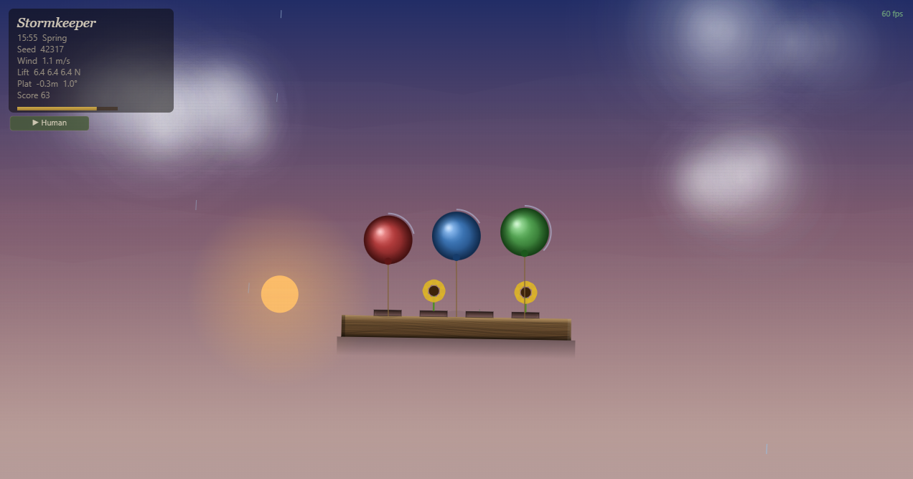
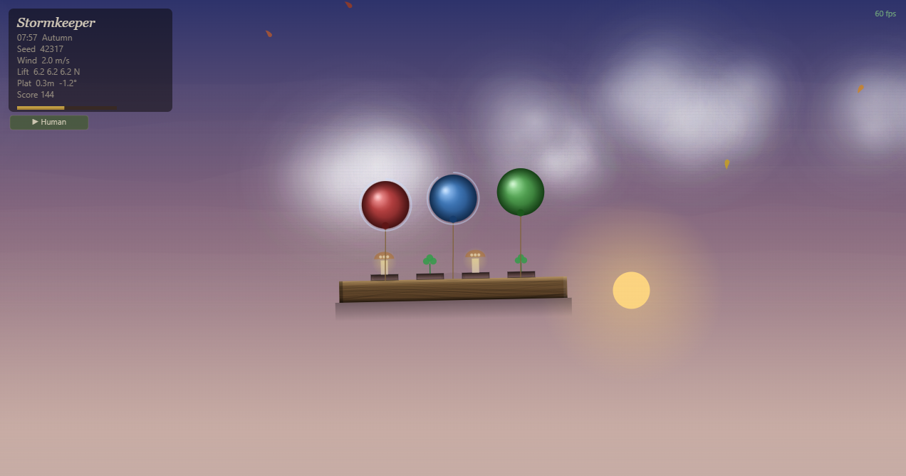
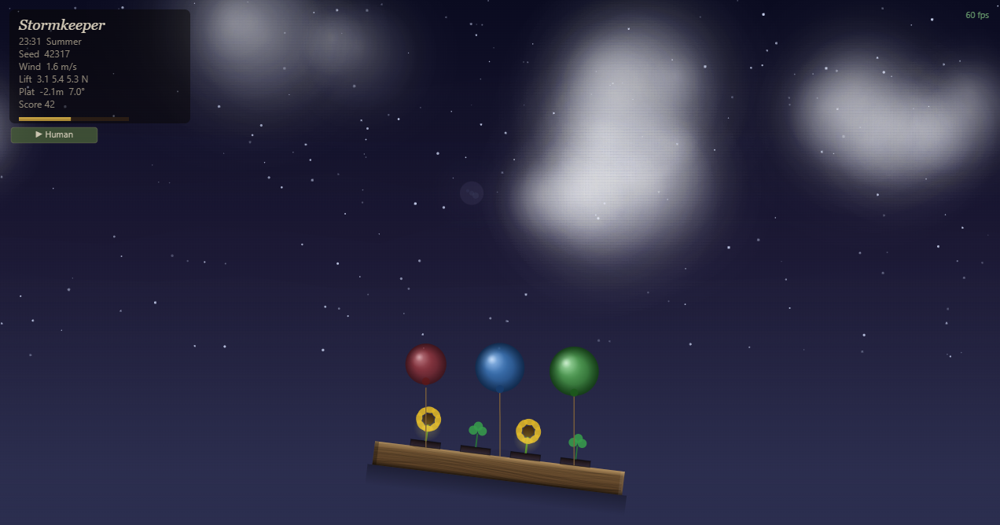
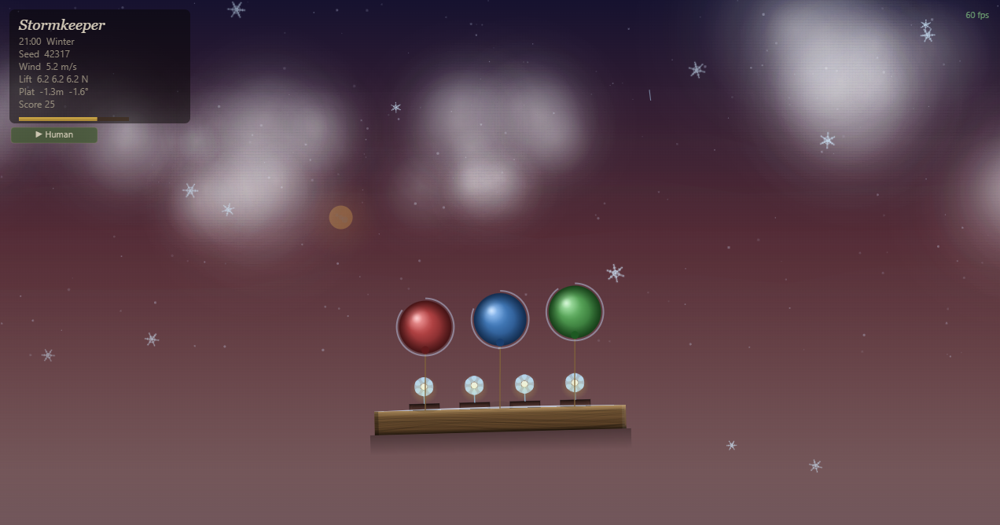
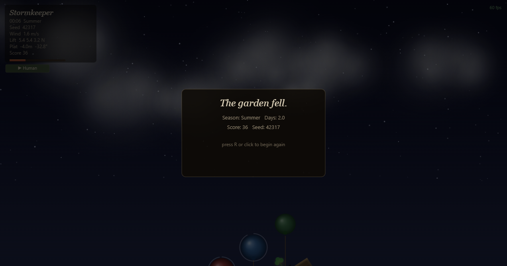
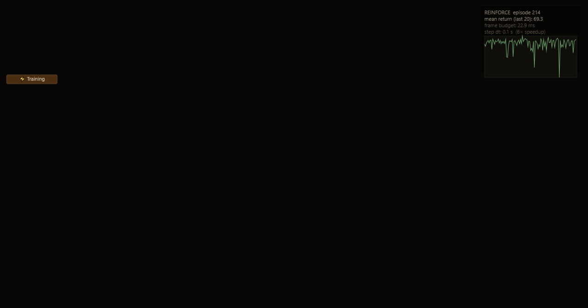

# Stormkeeper

A reproducible stochastic environment and from-scratch policy-gradient agent,
packaged as a single self-contained HTML file with no dependencies.

The project demonstrates six techniques that are independently testable and
academically relevant: an Ornstein-Uhlenbeck wind model, a semi-implicit Euler
physics integrator, a spatial-hash collision structure, a mulberry32 seeded RNG,
a Gym-style environment interface, and REINFORCE with hand-written Adam
optimisation — all in ~1 600 lines of vanilla JavaScript.

---

## What it demonstrates

| Technique | Where in code |
|---|---|
| **OU process** stochastic wind with seasonal parameters | `stepWind()` line 725 |
| **Semi-implicit Euler** integrator (unconditionally stable) | `stepPlatform()` line 758 |
| **Spatial hash** O(1) average collision queries | `SpatialHash` line 710 |
| **mulberry32** deterministic seeded RNG | `mulberry32()` line 127 |
| **Gym-style env** `reset/step` interface | `env` line 1251 |
| **REINFORCE + Adam** from scratch, no libraries | `policyUpdate()` line 1340 |

---

## How to run

Open `index.html` in any modern browser. No build step, no server, no network
calls. Everything runs client-side.

```
git clone <repo>
open index.html      # macOS
start index.html     # Windows
xdg-open index.html  # Linux
```

### Tests

- `tests/runTests.html` — pure-function unit tests (RNG, OU statistics, spatial hash)
- `tests/controlTests.html` — integration tests via the `SK` API (balloon physics, plant harvest, RL interface)
- `tests/liveTests.html` — end-to-end live tests with full rendering and click simulation

All three run in the browser with no dependencies.

---

## Environment specification

### Observation space — `Float32Array[47]`

| Indices | Feature | Normalisation |
|---|---|---|
| 0–1 | Wind velocity (x, y) | ÷ 15 m/s |
| 2–7 | Balloon lifts (3 real + 3 zero-pad) | ÷ `BALL_LIFT_0` (6.5 N) |
| 8 | Platform tilt | ÷ `PLAT_TMAX` (≈ 33°) |
| 9 | Snow load | ÷ 2.0 kg |
| 10 | Stamina | 0–1 |
| 11–14 | Season one-hot | spring/summer/autumn/winter |
| 15–46 | Nearest 8 hazard particles × 4 | x/W, y/H, vx/200, vy/200 |

### Action space — discrete(32)

| Actions | Description |
|---|---|
| 0 | do\_nothing |
| 1–3 | tap\_balloon\_i — reinflate balloon *i* (22 s cooldown) |
| 4–27 | gust at 6 × 4 canvas grid cell (24 positions) |
| 28–31 | harvest\_plant\_i |

### Reward shaping

```
+0.005 / step          survival (keeps agent from deliberately dying early)
+harvest_pts × 0.5     scaled plant harvest
-1 × dead_balloons     per balloon lost in the step
-15                    terminal penalty on tip-over or fall
+30                    win bonus (clears winter)
```

Known reward-hacking pattern: the survival signal is dense and balloon
reinflation has a higher reward-per-action ratio than planting, so the agent
typically learns to reinflate balloons and ignores harvesting entirely. This
is documented in the code, not hidden.

---

## Agent

REINFORCE with a single hidden layer (47 → 32 tanh → 32 softmax).
Weights initialised with Xavier uniform. Adam optimiser (lr = 3 × 10⁻⁴,
β₁ = 0.9, β₂ = 0.999). Returns normalised per-episode before the gradient
update as a simple variance-reduction trick.

Training runs in-browser in a `requestAnimationFrame` loop with a 13 ms per
frame budget. Rendering and particle physics are skipped during training
(`isTraining` flag). A coarser timestep (TRAIN\_DT = 0.1 s vs PHYS\_DT =
0.017 s) gives roughly 6× speedup; semi-implicit Euler remains stable at
this timestep.

Switch between **Human / Training / Playback** modes with the button in the
top-left corner. After training, open the browser console and run:

```javascript
SK.exportWeights()
```

Copy the output string and paste it back into the console on a fresh page
load to restore the trained policy without retraining.

---

## Screenshots

**Spring** — full balloon lift, sunflowers growing on the platform, warm dusk sky.



**Autumn** — orange dusk sky, seasonal plants, setting sun, sustained crosswind from the OU process.



**Winter** — dark night sky, snow accumulation on platform, frost-lily plants, ice building on balloons.



**Winter (snow detail)** — snow pile visible on platform edge, reddish late-season sky.



**End card** — game over screen showing season reached, days survived, score, and seed for reproducibility.



**Training mode** — rendering disabled for speed; episode 214, mean return (last 20) = 69.3, return curve top-right.



---

## Limitations and what a production setup would do differently

**Variance.** REINFORCE has high gradient variance. A baseline (value network
or moving-average return) would reduce variance significantly. The current
normalised-return trick helps but is not equivalent to a proper baseline.

**Partial observability.** The observation omits plant growth progress,
cooldown timers, and the lightning warning phase. A production env would
include these; their absence forces the agent to rely on the survival signal
alone.

**Action space size.** 32 discrete actions is small but not minimal. The
6 × 4 gust grid forces the agent to learn spatial relationships that a
continuous action space would express more naturally. A production setup
would use SAC or PPO with a continuous action for gust position.

**Training speed.** ~1 000 episodes in 1–3 minutes on a mid-range laptop.
Python + NumPy (or JAX) would be 100–1 000× faster, enabling the baseline
and more layers. The JS implementation trades speed for demonstrability and
zero-dependency reproducibility.

**Reward scale.** Survival reward (0.005/step × 3 300 steps = 16.5 max) and
the terminal penalty (−15) are on similar scales, which is intentional.
However the harvest reward (≈ 6–12 per plant) is large relative to survival,
creating an incentive the agent should exploit but in practice does not — a
consequence of the sparse harvest signal relative to the dense survival signal.

---

## How to read this codebase

Start with these six functions in order:

1. **`mulberry32` (line 127)** — the RNG. Everything stochastic is seeded
   from it; changing `SEED` replays the exact same weather, hazards, and
   plant schedule.

2. **`stepWind` (line 725)** — discrete Euler-Maruyama update of the OU
   process. One function call per physics tick; parameters swap on season
   change. The unit test in `runTests.html` verifies its stationary statistics.

3. **`stepPlatform` (line 758)** — the core integrator. Semi-implicit Euler
   on vertical velocity and angular velocity; reads balloon lift, snow load,
   leaf load, warm-gust force, and wind torque. Everything physical depends
   on this function.

4. **`buildObs` (line 1186)** — constructs the 47-element observation vector
   from live game state. The mapping between game variables and vector indices
   is documented in the constants block (lines 94–101).

5. **`policyForward` (line 1304)** — two matrix multiplies plus tanh and
   softmax, written as explicit loops. No library calls; the maths is
   readable line-by-line.

6. **`policyUpdate` (line 1340)** — REINFORCE gradient accumulation and Adam
   parameter update. Discounted returns are computed back-to-front, normalised,
   then used to weight the log-probability gradient at each step.

The `env` object (line 1251) wraps `resetGame` and `step` behind a
Gym-style interface so the RL loop is decoupled from game internals.

---

## CV bullet

> **Stormkeeper** (2025) — Designed and implemented a reproducible stochastic
> environment for reinforcement learning research entirely in the browser, with
> no external dependencies. The environment models seasonal weather via an
> Ornstein-Uhlenbeck process with per-season parameters, uses a semi-implicit
> Euler integrator for unconditional stability at coarse training timesteps, and
> exposes a Gym-compatible `reset`/`step` interface with a 47-dimensional
> observation space and 32 discrete actions. Trained a REINFORCE policy-gradient
> agent with a hand-written Adam optimiser and single hidden layer; documented
> convergence behaviour honestly, including the known reward-hacking pattern
> where the agent ignores plant harvesting in favour of the denser survival
> signal. All stochastic elements are seeded with mulberry32 for exact
> reproducibility. Tests cover RNG determinism, OU stationary statistics,
> spatial-hash correctness, and the full Gym interface.
